# Interfacing with STM8 Microcontroller

## Objectives:
 
1. On-Board LED Blinking
2. On-Board LED with Push Button
3. Interfacing HC-05 with STM8 and controlling LED by passing 1/0 to turn LED ON/OFF
4. Interfacing HC-05 with STM8 and sending “NMAMIT” to the Serial Monitor every 1 Second
5. Interfacing LED with STM8 and changing its Brightness using PWM

## 🛠  Tech Stack

**Hardware:**
- STM8 Microcontroller (STM8S003F3P6)
- ST-Link V2 Board (STM8S103F3P6 Programmer)
- HC-05 Bluetooth Module

**Software/Tools Used:** 
- ST Visual Develop (STVD)

  link: https://www.st.com/en/development-tools/stvd-stm8.html

- ST Visual Programmer (STVP)

  link: https://www.st.com/en/development-tools/stvp-stm8.html 

- Cosmic C Compiler

  link: https://www.cosmicsoftware.com/download_stm8_free.php

- Standard Peripheral Library (from GitHub)

  link: https://github.com/CircuitDigest/STM8S103F3_SPL

- Bluetooth Serial Monitor App (from Google Play Store)

  link: https://play.google.com/store/apps/details?id=de.kai_morich.serial_bluetooth_terminal

## Explaination of Hardware Components: 
- **STM8 Microcontroller:** The STM8S003F3P6 is a cost-effective 8-bit microcontroller based on the STM8 core architecture, designed by STMicroelectronics. It is part of the STM8 family, renowned for its versatility and efficiency in a wide range of applications.

  - **Key Features:**
     - STM8 Core: The microcontroller is powered by the STM8 core, offering a balance of performance and power efficiency for embedded applications.
     - Peripheral Integration: With various integrated peripherals, including GPIO, timers, UART, and more, the STM8S003F3P6 provides a comprehensive set of features for diverse applications.
     - Flash Memory: Featuring Flash memory for program storage, this microcontroller supports efficient and flexible code execution.

  - **Applications:**
    - Embedded Systems
    - IoT (Internet of Things) Devices
    - Consumer Electronics
    - Industrial Control Systems
  
     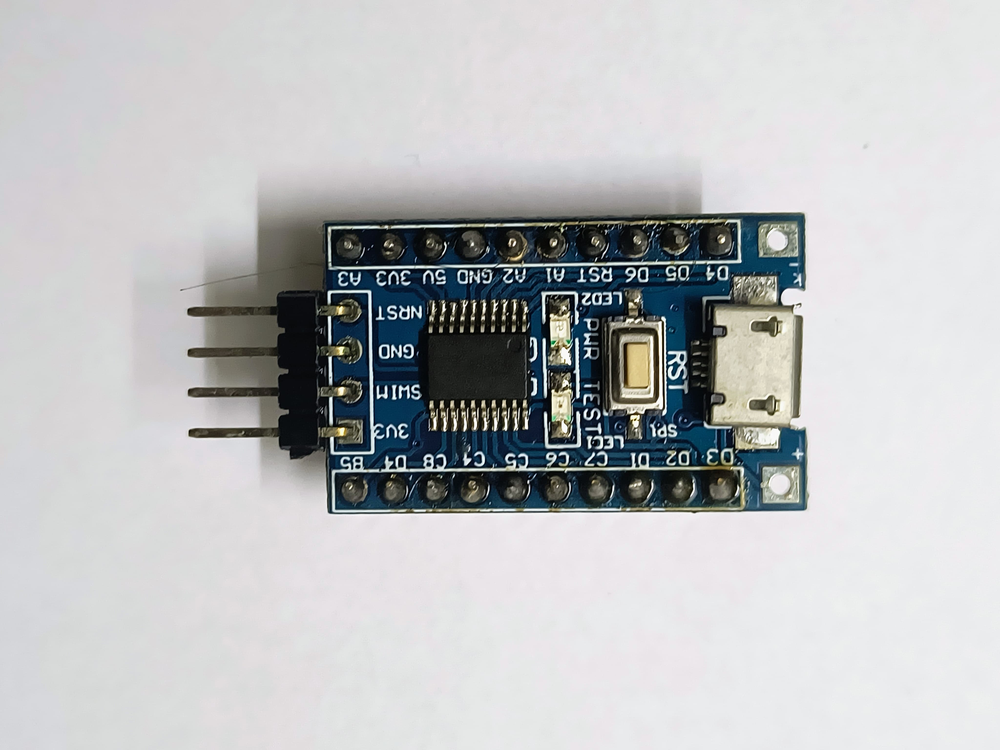

- **ST-Link V2 Board (STM8S103F3P6 Programmer) :** The ST-Link V2 Board is a compact and cost-effective programming and debugging tool developed by STMicroelectronics. It is commonly used for programming STM8 and STM32 microcontrollers and is particularly suitable for the STM8S103F3P6.

  - **Key Features**:
     - **Programming and Debugging:** The ST-Link V2 Board serves as both a programmer and debugger, allowing users to program their STM8S103F3P6 microcontroller and debug their applications.
     - **SWIM and SWD Support:** The board supports both SWIM (Single Wire Interface Module) for STM8 and SWD (Serial Wire Debug) for STM32, providing flexibility for different microcontroller families.
     - **USB Interface:** It connects to the host computer via USB, ensuring convenient and reliable communication for programming and debugging tasks.
     - **Versatile Use:** In addition to its compatibility with the STM8S103F3P6, the ST-Link V2 Board is widely used for various STM32 microcontrollers, making it a versatile tool for STM32 development.

  - **Usage:**
     - **Connectivity:** Connect the ST-Link V2 Board to the target STM8S103F3P6 microcontroller using the appropriate SWIM interface.
     - **Debugging:** Leverage the board's debugging capabilities with an integrated debugger in your chosen IDE (Integrated Development Environment).
  
    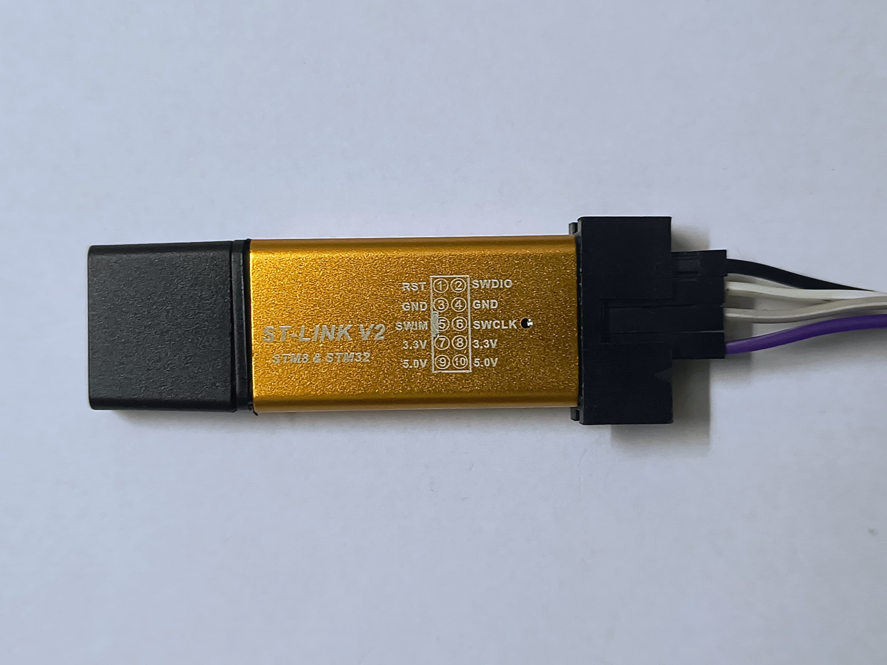

 - **Connection:**
       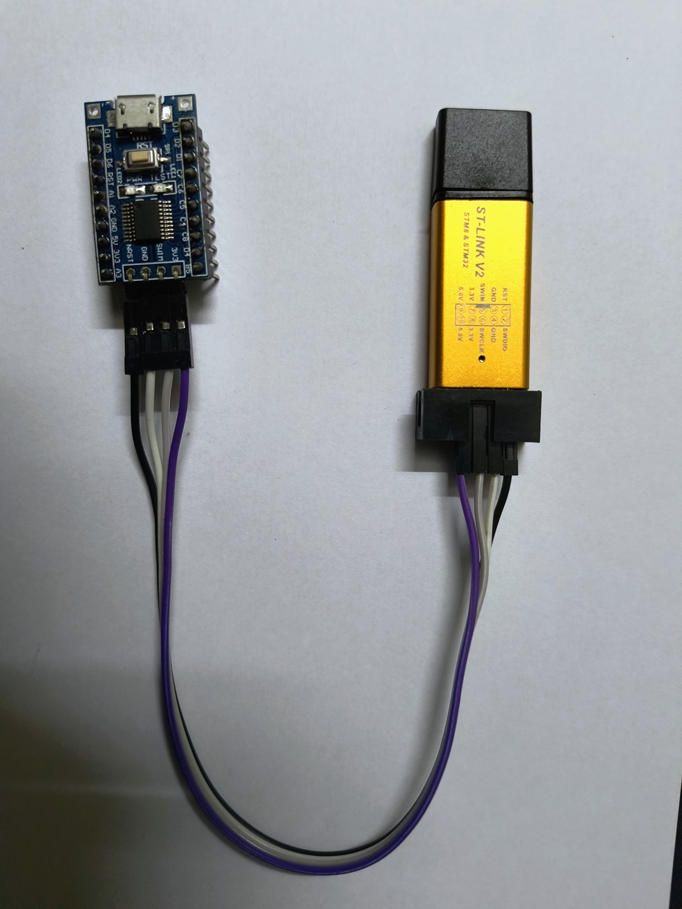
- **HC-08 Bluetooth Module :** The HC-05 is a widely used Bluetooth module that facilitates wireless communication between electronic devices. This module is versatile and popular in various applications, including IoT (Internet of Things) projects, robotics, and embedded systems.

   - **Key Features**:
      - **Bluetooth Connectivity:** The HC-05 module supports Bluetooth communication, allowing devices to establish wireless connections over short distances.
  
      - **Serial Communication:** It provides a simple and easy-to-use serial communication interface, making it compatible with a wide range of microcontrollers and embedded systems.

      - **Configurable Modes:** The HC-05 module can operate in both Master and Slave modes, offering flexibility for different communication scenarios.

      - **Ease of Integration:** With its compact form factor and straightforward interface, the HC-05 is relatively easy to integrate into various electronic projects.

   - **Pin Configuration:** The HC-05 Bluetooth Module typically has the following pin configuration:

      - **VCC:** Power supply voltage (3.3V or 5V).
  
      - **GND:** Ground.
  
      - **TXD:** Transmit Data (connects to the RX pin of the microcontroller).
  
      - **RXD:** Receive Data (connects to the TX pin of the microcontroller).
  
      - **STATE:** Indicates the current state of the module (optional).

  - **Usage:**

     - **Power Supply:** Connect the VCC and GND pins to the appropriate power sources.
  
     - **Serial Communication:** Connect the TXD and RXD pins to the microcontroller's RX and TX pins, respectively.

     - **Mode Configuration:** Set the mode (Master or Slave) based on your application requirements.

      - **Pairing:** Pair the HC-05 module with the target Bluetooth device using the appropriate pairing process.

    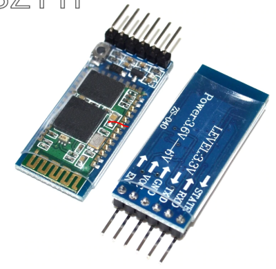

## Working of code:
1. **On-Board LED Blinking:** 
- #define LED GPIOB, GPIO_PIN_5: This line creates a macro named "LED" that represents GPIOB (Port B) and pin 5 on that port.

- #include "STM8S.h": This line includes a header file necessary for working with the STM8S microcontroller. It likely contains definitions and configurations specific to the STM8S.

- void delay(int ms): This function takes an integer argument ms (milliseconds) and creates a simple delay function using nested loops. The delay is created by iterating ms times, with an inner loop that runs 120 times.

- void main(): This is the main function that serves as the entry point for the program.

- GPIO_DeInit(GPIOB): This line initializes or resets the GPIO (General Purpose Input/Output) Port B for use.

- GPIO_Init(LED, GPIO_MODE_OUT_PP_LOW_SLOW): This line configures the pin specified by the "LED" macro as a push-pull output with low level (LED is active low) and slow speed.

- while (1) { ... }: This creates an infinite loop that toggles the state of the LED (turns it on or off) using GPIO_WriteReverse(LED) and then introduces a delay of 500 milliseconds using the delay(500) function.

- ***Output:***

https://github.com/sourabhshenoy04/interfacing_with_STM8_microcontroller/assets/105969078/eb154892-de4a-44c0-adaa-9dd89923fc64

  
2. **On-Board LED with Push Button**
- #define LED GPIOB,GPIO_PIN_5 //onboard LED: This line creates a macro named "LED" representing Port B and pin 5, which is typically connected to an onboard LED.

- #include "STM8S.h": This line includes a header file needed for working with the STM8S microcontroller.

- void delay (int ms): This line declares a function named delay that takes an integer argument ms (milliseconds) and creates a delay using nested loops.

- GPIO_DeInit(GPIOA); and GPIO_DeInit(GPIOB);: These lines reset or initialize Port A and Port B for use.

- GPIO_Init (GPIOA, GPIO_PIN_2, GPIO_MODE_IN_PU_IT);: This line configures pin 2 on Port A as an input with a pull-up resistor and interrupt capability.

- GPIO_Init (GPIOB, GPIO_PIN_5, GPIO_MODE_OUT_PP_LOW_SLOW);//onboard led: This line configures pin 5 on Port B as a push-pull output with low level (onboard LED is active low) and slow speed.

- while (1) { ... }: This creates an infinite loop that checks the state of pin 2 on Port A. If the button connected to this pin is pressed (GPIO_ReadInputPin(GPIOA, GPIO_PIN_2) is true), it turns on the LED (GPIO_WriteHigh(LED)); otherwise, it turns off the LED (GPIO_WriteLow(LED)).

- delay (100);: After checking the button state and updating the LED, the program introduces a delay of 100 milliseconds.

- ***Output:***

https://github.com/sourabhshenoy04/interfacing_with_STM8_microcontroller/assets/105969078/538bf0c9-f3ae-479f-b146-c9a4d109b6ce

  
3. **Interfacing HC-05 with STM8 and controlling LED by passing 1/0 to turn LED ON/OFF:**
- #include "stm8s.h": This line includes the necessary header file for STM8S microcontroller programming.

- #define LED GPIOB,GPIO_PIN_5 //onboard LED: This line creates a macro named "LED" representing Port B and pin 5, which is likely connected to an onboard LED.

- void UART_Config(void);: This is a function prototype declaration for a function named UART_Config that will configure the UART (Universal Asynchronous Receiver/Transmitter).

- void main(void) { ... }: This is the main function, the entry point of the program.

- UART_Config();: This line calls the function UART_Config() to initialize and configure the UART.

- GPIO_DeInit(GPIOB);: This line resets or initializes Port B for use.

- GPIO_Init (GPIOB, GPIO_PIN_5, GPIO_MODE_OUT_PP_HIGH_FAST);: This line configures pin 5 on Port B as a push-pull output with high level (onboard LED is active high) and fast speed.

- The while (1) loop: This is an infinite loop that continually checks if data is received on the UART. If data is received, it reads the received data and checks if it is '0' or '1'. If '0' is received, it turns on the LED; if '1' is received, it turns off the LED.

- void UART_Config(void) { ... }: This is the function definition for configuring the UART. It uses the UART1 module, initializes it with a baud rate of 9600, 8 data bits, 1 stop bit, and no parity. It also enables the UART receive interrupt and enables the UART1 module.

- ***Output:***

  

https://github.com/sourabhshenoy04/interfacing_with_STM8_microcontroller/assets/105969078/4fc7347b-8491-44cc-ad64-5a3a4e0cf520

  
4. **Interfacing HC-05 with STM8 and sending “NMAMIT” to the Serial Monitor every 1 second**
- #include "stm8s.h": Includes the necessary header file for STM8S microcontroller programming.

- #include <string.h>: Includes the standard C library for string manipulation.

- #define LED GPIOB, GPIO_PIN_5 // onboard LED: Macro definition for the onboard LED on Port B, Pin 5.

- Function Prototypes:

    - void UART_Config(void);: Function prototype for configuring UART communication.
    - void sendTextToBluetooth(const char *text);: Function prototype for sending text through UART.
- void delay(int ms): Definition of a simple delay function using nested loops.
- void main(void) { ... }: The main function, the entry point of the program.

- GPIO_DeInit(GPIOB);: Resets or initializes Port B for use.

- GPIO_Init(GPIOB, GPIO_PIN_5, GPIO_MODE_OUT_PP_HIGH_FAST);: Configures Pin 5 on Port B as a push-pull output with high level (active high) and fast speed.

- UART_Config();: Calls the function to configure UART communication.

- The while (1) loop:

    - Turns on the LED by setting the GPIO pin low (GPIO_WriteLow(LED)).
    - Sends the text "NMAMIT!\r\n" to the Bluetooth terminal using sendTextToBluetooth.
    - Introduces a delay of 1000 milliseconds.
    - Turns off the LED by setting the GPIO pin high (GPIO_WriteHigh(LED)).
    - Introduces another delay of 1000 milliseconds.
- void UART_Config(void) { ... }: Function definition for configuring UART1 with a baud rate of 9600, 8 data bits, 1 stop bit, and no parity. It enables the UART1 module.

- void sendTextToBluetooth(const char *text) { ... }: Function definition to send text through UART. It iterates through each character in the input text, waits until the UART is ready to transmit, sends the character, and waits for the transmission to complete.
- ***Output:***

https://github.com/sourabhshenoy04/interfacing_with_STM8_microcontroller/assets/105969078/d5de7733-4d8e-4b82-a797-47c6fc8d53c4

  
5. **Interfacing LED with STM8 and changing its Brightness using PWM:** 
- #include "STM8S.h": This line includes the necessary header file for STM8S microcontroller programming.

- signed int pwm_duty = 0;: Declaration of a signed integer variable pwm_duty to control the PWM duty cycle.

- void delay_ms(int ms): Definition of a simple delay function using nested loops, which causes a delay of ms milliseconds.

- void main(void) { ... }: The main function, the entry point of the program.

- GPIO_DeInit(GPIOD);: Resets or initializes Port D for use.

- TIM2_DeInit();: Resets or initializes Timer 2 for use.

- GPIO_Init(GPIOD, GPIO_PIN_4, GPIO_MODE_OUT_PP_HIGH_FAST);: Configures Pin 4 on Port D as a push-pull output with high level (active high) and fast speed.

- TIM2_OC1Init(TIM2_OCMODE_PWM1, TIM2_OUTPUTSTATE_ENABLE, 1000, TIM2_OCPOLARITY_HIGH);: Initializes Timer 2 Channel 1 for PWM generation. It sets the PWM mode, enables the output, sets the period to 1000, and sets the polarity to high.

- TIM2_TimeBaseInit(TIM2_PRESCALER_1, 500);: Initializes the Time Base Unit of Timer 2. It sets the prescaler to 1 and the period to 500.

- TIM2_Cmd(ENABLE);: Enables Timer 2.

- The main loop:

    - The loop starts with a for loop where pwm_duty increases from 0 to 1000 with a step size of 2. This increases the duty cycle of the PWM signal.
    - TIM2_SetCompare1(pwm_duty);: Sets the compare value for Timer 2 Channel 1, effectively controlling the PWM duty cycle.
    - delay_ms(10);: Introduces a delay of 10 milliseconds.
    - After reaching a duty cycle of 1000, the loop reverses, decreasing the duty cycle until reaching 0.
    - This creates a fading effect on the LED connected to Pin 4 of Port D.

- ***Output:***

https://github.com/sourabhshenoy04/interfacing_with_STM8_microcontroller/assets/105969078/2cae1512-2f8d-457e-a452-f40e090a8af1

  
## a) Steps in STVD :

1. Open the Software

 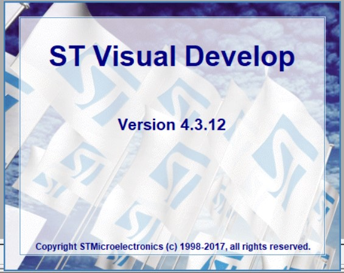

2. Click on File and Create a New Workspace

  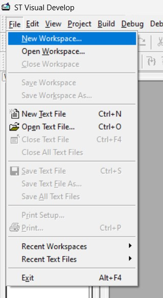

3. Click on Create Workspace
   
  

4. Give the workspace file name and the set the workspace Location
 
 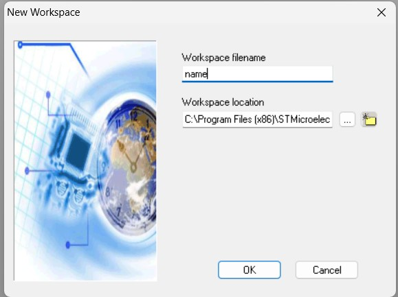

5. Give the Project Name and Select the Tool Chain as STM8 Cosmic
  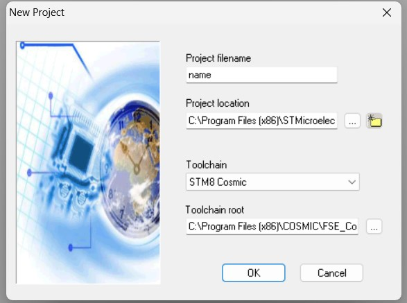

Set the toolchain root as :-
C:\Program Files (x86)\COSMIC\FSE_Compilers\CXSTM8

6. Select the Appropriate MCU
     
  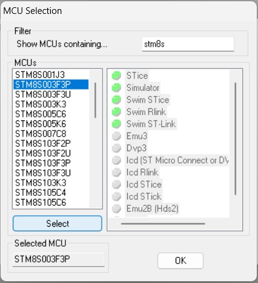

7. Right click on Source Files and add Source Files (.c)
    
  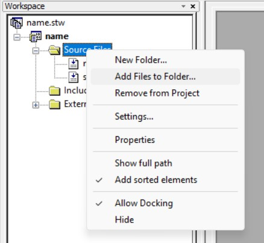

  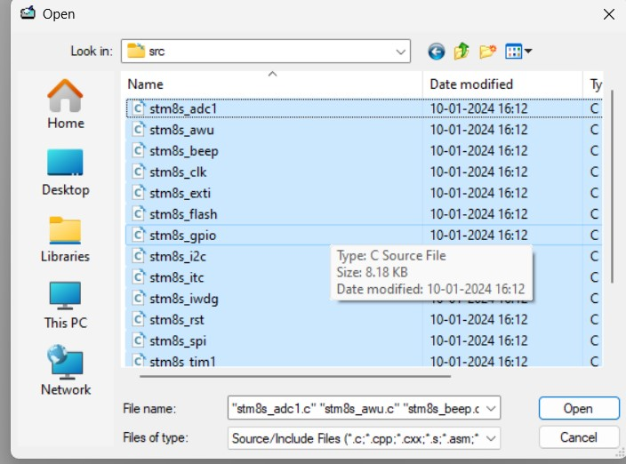

8. Right click on Include Files and add Include Files (.h)
   
  

  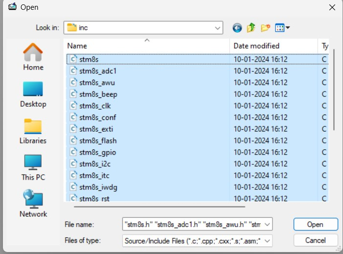

9.	Write the code in main.c file

10. Compile and Build the program

 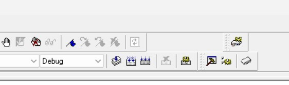

11. If you have followed the steps properly, this will appear:
  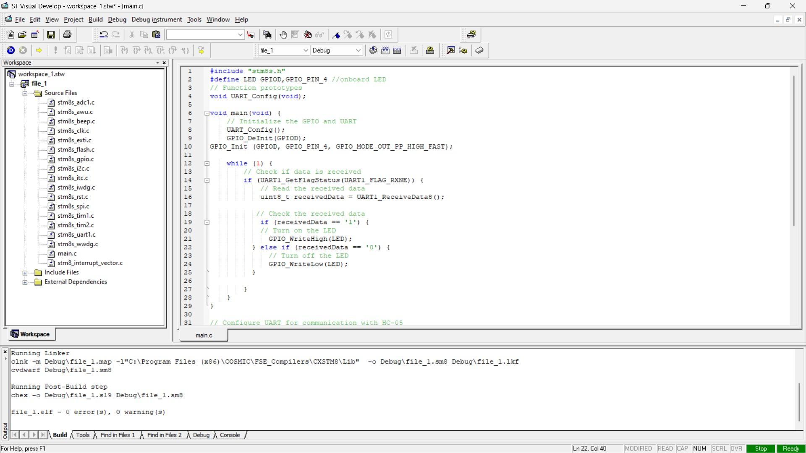

## b) Steps in STVP :
1. Open ST Visual Programmer

 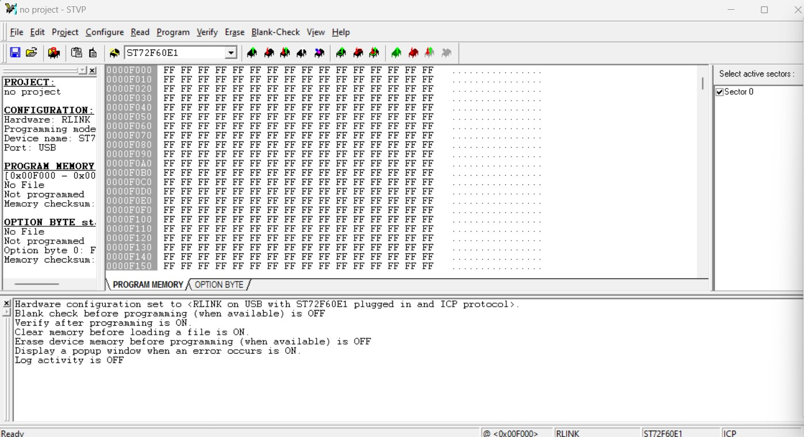
 
2. Click on File > Open

 

3. Select .s19 file > Open

 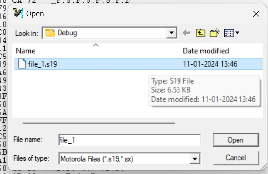 

4. Click on Configure

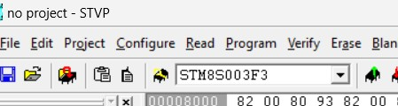 

5. Select these Specifications

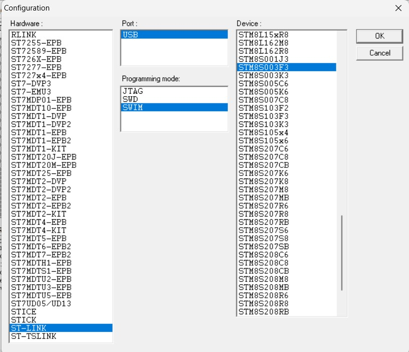    

6. Click on Program > Current Tab OR CTRL+P

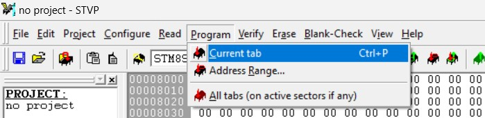    

7. Repeat the Configuration procedure or Reconnect the ST LINK V2 (Debugger)

    

  

## Complete installation process:
- You can refer this YouTube Video :

  https://www.youtube.com/watch?v=ho5wF6C_mYs&ab_channel=BadMek

